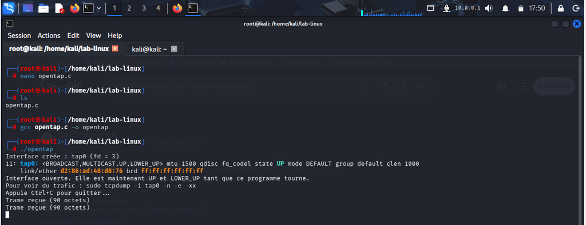
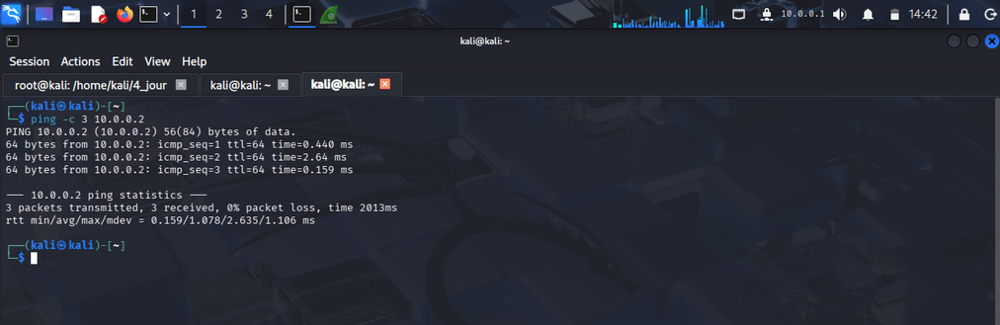
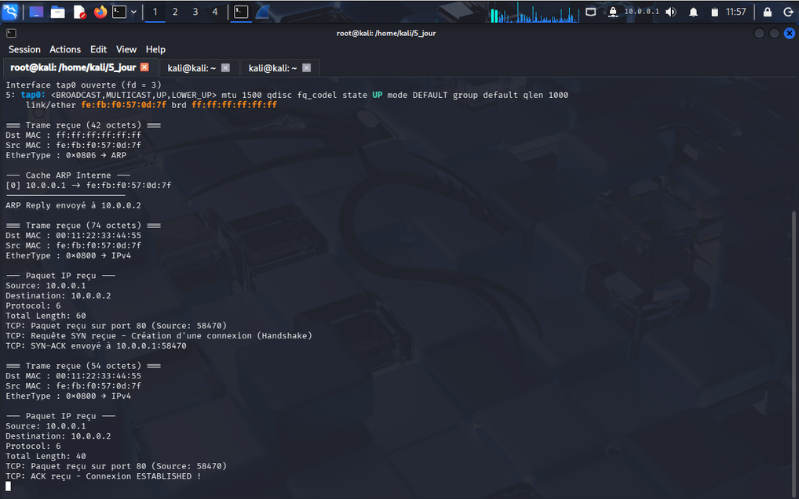
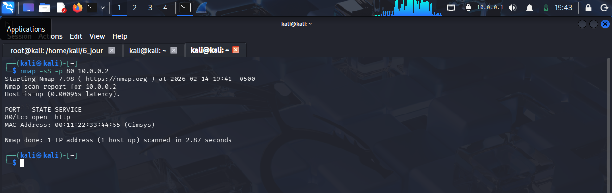
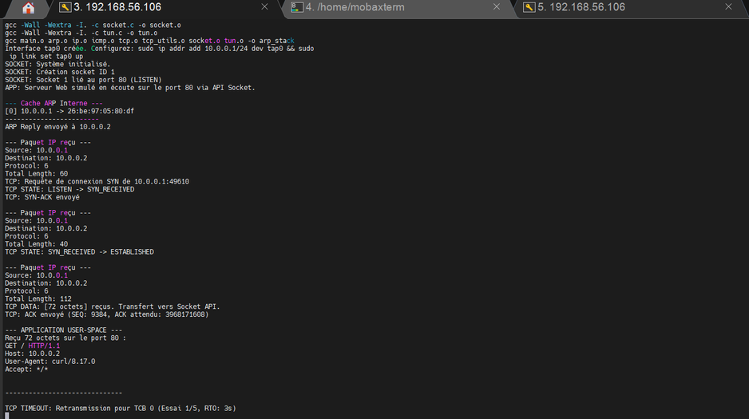

# Implementation d'une pile TCP/IP en espace utilisateur

Ce depot contient une pile TCP/IP minimale ecrite en C, executee en espace
utilisateur sous Linux. Le trafic de niveau 2 est echange avec le noyau via une
interface TAP. La progression pedagogique s'appuie sur la serie
[Let's code a TCP/IP stack](https://www.saminiir.com/lets-code-tcp-ip-stack-1-ethernet-arp/)
et le depot [saminiir/level-ip](https://github.com/saminiir/level-ip).

Chaque etape dispose d'un dossier `JourNN_*` (numerotation a deux chiffres) et
d'un compte rendu `JourN_TCP_IP.pdf`. Le code actuel se trouve dans
[`Jour11_Chemin_Sortie`](./Jour11_Chemin_Sortie).

## Topologie de laboratoire

L'hote Linux (cote noyau) configure `tap0` avec une adresse du reseau
d'experimentation. La pile userspace repond sous une autre adresse du meme
reseau, avec une adresse MAC fixe `00:11:22:33:44:55`. Dans les comptes rendus,
cette paire vaut `10.0.0.1/24` (hote) et `10.0.0.2` (pile). Ces valeurs se
modifient dans le code et dans les commandes `ip`.

```bash
sudo ip tuntap add dev tap0 mode tap user "$USER"
sudo ip link set tap0 up
sudo ip addr add 10.0.0.1/24 dev tap0
```

Compilation et execution (repertoire du jour concerne) :

```bash
make
sudo ./tcpstack
```

Transfert vers une machine de test (remplacer `USER` et `HOST`) :

```bash
scp -r Jour11_Chemin_Sortie USER@HOST:~/jour11/
```

## Deroule

**Jours 1 et 2.** Creation de `tap0` et lecture de trames Ethernet brutes
(`IFF_TAP | IFF_NO_PI`). Sans processus ouvrant le descripteur, l'interface
reste operationnellement inactive. Le parseur separe destination, source et
`ethertype`. Les premieres captures Wireshark montrent notamment du multicast
IPv6 emis par le noyau. L'en-tete Ethernet n'etant pas authentifie, un octet
altere suffit a changer l'identite de liaison (usurpation MAC).



**Jours 2 (fin) et 3.** Mise en oeuvre d'ARP (RFC 826) : validation des champs,
cache, reponse si la cible est l'adresse de la pile. L'IPv4 est ensuite parse
(version, checksum d'en-tete). Un `ping` vers `10.0.0.2` expire a ce stade :
la pile lit la trame, repond a ARP et verifie le checksum IP, mais n'emet pas
encore d'Echo Reply.

**Jour 4.** ICMP Echo : inversion du type (8 vers 0), recalcul du checksum
(RFC 1071, meme algorithme que l'IP). Le ping aboutit. Le compte rendu
rappelle l'amplification de type Smurf (Echo Request usurpée vers une
adresse de diffusion).



**Jours 5 et 6.** Introduction du TCB et du handshake a trois messages
(SYN, SYN-ACK, ACK). `nc` vers le port 80 atteint ESTABLISHED. Une machine a
etats (LISTEN, SYN_RECEIVED, ESTABLISHED, CLOSED) permet de rejeter un segment
de donnees hors session. Un RST est emis si la table TCB est pleine ou si le
segment ne correspond a aucune connexion. Un `nmap -sS` obtient SYN-ACK puis
envoie RST (scan furtif) : le port apparait ouvert sans session complete.





**Jours 7 et 8.** TCP est traite comme un flux d'octets : ACK = RCV.NXT +
longueur utile. Test : `echo "Salut" | nc 10.0.0.2 80`. Une API socket
in-process (`xsocket`, `xbind`, `xrecv`) separe pile et application. Un
message sur un port sans socket d'ecoute n'est pas livre a l'application.
Sans chiffrement, toute injection dont les numeros de sequence sont acceptes
atteint l'application.

**Jours 9 et 10.** Retransmission sur timeout (RTO, ARQ, backoff) testee avec
un client qui n'acheve pas le handshake. La fermeture passive (FIN, LAST_ACK,
CLOSED) libere le TCB. Un `curl` livre le `GET /` a la couche socket ; en
l'absence de `xsend`, le client n'obtient pas de reponse HTTP, d'ou
retransmissions et accusés dupliques, comportement conforme a TCP. Un RST
entrant coupe encore trop facilement une session (fenetre de sequence).



**Jour 11.** Correction du chemin de sortie : inversion des adresses IP et MAC
sur le SYN-ACK, verification du checksum TCP en entree, allocation de TCB
uniquement si un socket ecoute le port, acceptation d'un RST si SEQ egal
RCV.NXT. Voir [`Jour11_Chemin_Sortie`](./Jour11_Chemin_Sortie).

## Organisation des sources

| Dossier | Contenu |
|---|---|
| [Jour01_Ethernet_TAP](./Jour01_Ethernet_TAP) | Interface TAP et trames Ethernet |
| [Jour02_ARP](./Jour02_ARP) | Decodage Ethernet et ARP |
| [Jour03_IP_ICMP](./Jour03_IP_ICMP) | Cache ARP, entete IPv4 |
| [Jour04_TCP_Handshake](./Jour04_TCP_Handshake) | ICMP Echo Request / Reply |
| [Jour05_TCP_Established](./Jour05_TCP_Established) | TCB et handshake TCP |
| [Jour06_TCP_Data_Transfer](./Jour06_TCP_Data_Transfer) | Machine a etats, RST, scan SYN |
| [Jour07_Socket_API](./Jour07_Socket_API) | Flux d'octets, SEQ/ACK |
| [Jour08_Retransmission_RTO](./Jour08_Retransmission_RTO) | API socket, injection applicative |
| [Jour09_Congestion_Control](./Jour09_Congestion_Control) | RTO, retransmission, congestion |
| [Jour10_TCP_Termination](./Jour10_TCP_Termination) | Fermeture FIN, tests curl |
| [Jour11_Chemin_Sortie](./Jour11_Chemin_Sortie) | Corrections du chemin de sortie |
